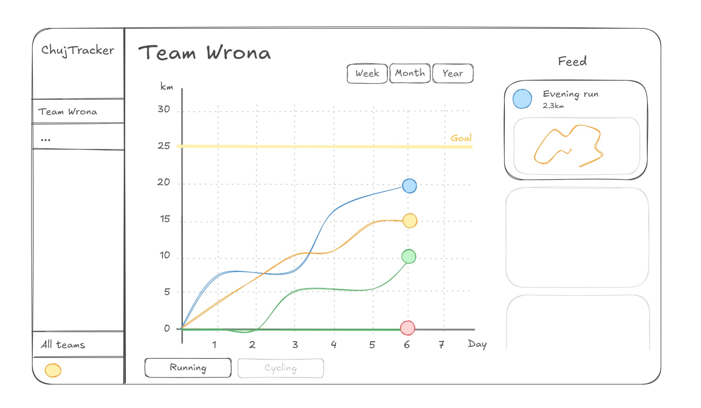

## 📋 Zadania

### 🛠 Do zrobienia:

- [ ] Usunąć ciemne tło z logo
- [ ] Dodać obsługę logowania poprzez stravę
- [ ] Dodać stopkę z informacją "Powered by Strava"

### ✅ Zrobione:

- [x] Komponent z przyciskiem do logowania poprzez Strave
- [x] Strona główna zawierająca jakieś informacje i przycisk do logowania

---

## 📌 Wytyczne dotyczące korzystania z API Strava

Aplikacja musi przestrzegać oficjalnych wytycznych

**Kluczowe zasady:**

- Obowiązkowy przycisk „Connect with Strava” – należy używać oficjalnej wersji, bez modyfikacji.
- Logo „Powered by Strava” – musi być widoczne w aplikacji i materiałach promocyjnych.
- Linkowanie do Strava – każda prezentowana aktywność powinna zawierać link „View on Strava”.
- Zakaz sugerowania oficjalnej współpracy – aplikacja nie może wyglądać jak produkt Strava.

Szczegóły i pełne wytyczne: [Strava API Guidelines](https://developers.strava.com/guidelines/)

https://developers.strava.com/docs/reference/
https://developers.strava.com/docs/authentication/
